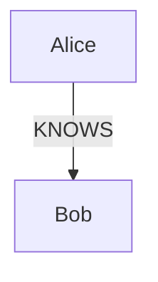
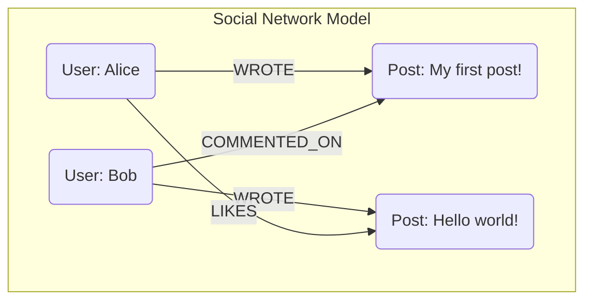

# A Developer's Guide to Graph Databases & Neo4j

This guide provides a comprehensive introduction to the world of graph databases, using Neo4j and its query language, Cypher, as a practical example. It's designed for developers who are familiar with relational databases (like SQL) and want to understand this powerful alternative.

## Part 1: The World of Graph Databases

### What is a Graph Database?

At its core, a **graph database** is a system designed to store and navigate relationships. Unlike other databases that might infer connections through foreign keys or other structures, a graph database treats relationships as first-class citizens.

The fundamental building blocks of any graph database are:

1.  **Nodes:** These are the entities or objects in your data. If you were modeling a social network, a `Person`, a `Post`, or a `Comment` would all be nodes.
2.  **Relationships (or Edges):** These are the connections between nodes. A relationship always has a start node, an end node, a type, and a direction. For example, a `Person` node might have a `WROTE` relationship to a `Post` node.
3.  **Properties:** These are key-value pairs that store data on your nodes and relationships. A `Person` node could have properties like `name: "Alice"` and `age: 30`. A `WROTE` relationship could have a `timestamp` property.

### Graph vs. Relational (SQL): A Paradigm Shift

The easiest way to understand the difference is to see how they model the same simple scenario: "Alice knows Bob."

#### Relational Model (SQL)

In a relational database, you would need at least three tables to model a many-to-many relationship like this:

-   A `people` table to store users.
-   A `people_friends` join table to connect them.

To find out who Alice knows, you would perform a `JOIN` operation:

```sql
SELECT p2.name
FROM people p1
JOIN people_friends pf ON p1.id = pf.person_id
JOIN people p2 ON pf.friend_id = p2.id
WHERE p1.name = 'Alice';
```

#### Graph Model

In a graph database, the model is much more direct and intuitive.



The query to find who Alice knows is a simple traversal:

```cypher
MATCH (p:Person {name: 'Alice'})-[:KNOWS]->(friend:Person)
RETURN friend.name
```

As the complexity of your queries grows (e.g., "find the friends of Alice's friends who also commented on her latest post"), the number of `JOIN`s in SQL can become unwieldy and slow. In a graph, you just describe a longer path. This is the primary advantage of a graph database.

## Part 2: Introduction to Neo4j and Cypher

**Neo4j** is the most popular graph database management system. It uses the property graph model described above.

**Cypher** is Neo4j's declarative query language. It's designed to be easy to read and uses an "ASCII-Art" style to represent graph patterns.

### Core Cypher Syntax

-   **Nodes** are represented with parentheses: `()`
    -   ` (p:Person) ` - A node with the variable `p` and the label `Person`.
    -   ` (m:Movie {title: 'The Matrix'}) ` - A node with properties.
-   **Relationships** are represented with square brackets: `[]`
    -   ` -[r:ACTED_IN]-> ` - A relationship with the variable `r` and the type `ACTED_IN`. The arrow indicates direction.
-   **Patterns** combine nodes and relationships.
    -   ` (actor:Person)-[:ACTED_IN]->(movie:Movie) `

### Reading Data with `MATCH`

`MATCH` is used to specify the pattern of nodes and relationships you are looking for.

```cypher
-- Find all movies released in 1999
MATCH (m:Movie)
WHERE m.released = 1999
RETURN m.title
```

```cypher
-- Find all actors who acted in "The Matrix"
MATCH (actor:Person)-[:ACTED_IN]->(movie:Movie {title: 'The Matrix'})
RETURN actor.name
```

### Writing Data with `CREATE` and `MERGE`

`CREATE` will always create new nodes and relationships.

```cypher
-- Create two nodes and a relationship between them
CREATE (p1:Person {name: 'Alice'})-[r:KNOWS {since: 2021}]->(p2:Person {name: 'Bob'})
```

`MERGE` is a powerful combination of `MATCH` and `CREATE`. It will find a pattern if it exists, or create it if it doesn't. This is useful for avoiding duplicate data.

```cypher
-- This will create a 'Carol' node if one doesn't already exist.
-- If you run it again, it will do nothing.
MERGE (p:Person {name: 'Carol'})
```

## Part 3: Practical Example - A Mini Social Network

Let's model a simple social network where users can write posts and comment on them.



### Step 1: Create the Nodes and Relationships

```cypher
// Create users
MERGE (alice:User {name: 'Alice'});
MERGE (bob:User {name: 'Bob'});

// Create posts and link them to their authors
MERGE (p1:Post {text: 'My first post!'})
MERGE (alice)-[:WROTE]->(p1);

MERGE (p2:Post {text: 'Hello world!'})
MERGE (bob)-[:WROTE]->(p2);

// Create interactions
MERGE (bob)-[:COMMENTED_ON {text: 'Great post!'}]->(p1);
MERGE (alice)-[:LIKES]->(p2);
```

### Step 2: Query the Graph

Now that we have data, we can ask interesting questions.

**Query 1: Who wrote the post "Hello world!"?**

```cypher
MATCH (u:User)-[:WROTE]->(p:Post {text: 'Hello world!'})
RETURN u.name
// Expected: "Bob"
```

**Query 2: What comments were made on Alice's posts?**

```cypher
MATCH (alice:User {name: 'Alice'})-[:WROTE]->(post:Post)<-[c:COMMENTED_ON]-(commenter:User)
RETURN commenter.name, c.text
// Expected: "Bob", "Great post!"
```

**Query 3: Who does Alice interact with? (Who has she liked or who has commented on her posts?)**

```cypher
MATCH (alice:User {name: 'Alice'})-[]->(post)<-[]-(otherUser:User)
RETURN DISTINCT otherUser.name
// Expected: "Bob"
```

## Conclusion

Graph databases excel when the **relationships between data are the key to your application**. They provide an intuitive way to model complex, interconnected systems and offer significant performance advantages for "pathfinding" or traversal queries compared to relational databases.

Neo4j and Cypher provide a mature and developer-friendly entry point into this world. By thinking in terms of nodes, relationships, and patterns, you can solve complex problems that would be difficult and inefficient to tackle with a traditional relational approach.
