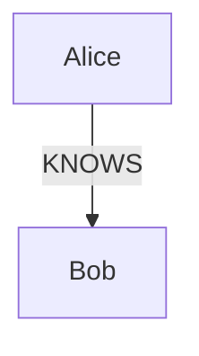
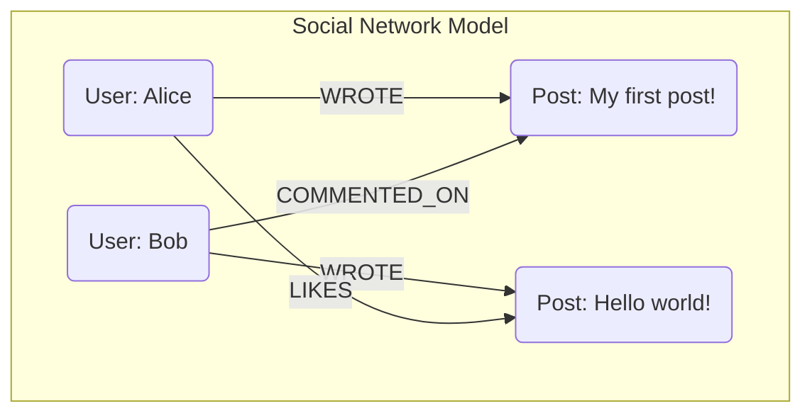

# A Developer's Guide to Graph Databases & Neo4j

This guide provides a comprehensive introduction to the world of graph databases, using Neo4j and its query language, Cypher, as a practical example. It's designed for developers who are familiar with relational databases (like SQL) and want to understand this powerful alternative.

## Part 1: The World of Graph Databases

### What is a Graph Database?

At its core, a **graph database** is a system designed to store and navigate relationships. Unlike other databases that might infer connections through foreign keys or other structures, a graph database treats relationships as first-class citizens.

The fundamental building blocks of any graph database are:

1.  **Nodes:** These are the entities or objects in your data. If you were modeling a social network, a `Person`, a `Post`, or a `Comment` would all be nodes.
2.  **Relationships (or Edges):** These are the connections between nodes. A relationship always has a start node, an end node, a type, and a direction. For example, a `Person` node might have a `WROTE` relationship to a `Post` node.
3.  **Properties:** These are key-value pairs that store data on your nodes and relationships. A `Person` node could have properties like `name: "Alice"` and `age: 30`. A `WROTE` relationship could have a `timestamp` property.

### Graph vs. Relational (SQL): A Paradigm Shift

The easiest way to understand the difference is to see how they model the same simple scenario: "Alice knows Bob."

#### Relational Model (SQL)

In a relational database, you would need at least three tables to model a many-to-many relationship like this:

-   A `people` table to store users.
-   A `people_friends` join table to connect them.

To find out who Alice knows, you would perform a `JOIN` operation:

```sql
SELECT p2.name
FROM people p1
JOIN people_friends pf ON p1.id = pf.person_id
JOIN people p2 ON pf.friend_id = p2.id
WHERE p1.name = 'Alice';
```

#### Graph Model

In a graph database, the model is much more direct and intuitive.



The query to find who Alice knows is a simple traversal:

```cypher
MATCH (p:Person {name: 'Alice'})-[:KNOWS]->(friend:Person)
RETURN friend.name
```

As the complexity of your queries grows (e.g., "find the friends of Alice's friends who also commented on her latest post"), the number of `JOIN`s in SQL can become unwieldy and slow. In a graph, you just describe a longer path. This is the primary advantage of a graph database.

## Part 2: Introduction to Neo4j and Cypher

**Neo4j** is the most popular graph database management system. It uses the property graph model described above.

**Cypher** is Neo4j's declarative query language. It's designed to be easy to read and uses an "ASCII-Art" style to represent graph patterns.

### Core Cypher Syntax

-   **Nodes** are represented with parentheses: `()`
    -   ` (p:Person) ` - A node with the variable `p` and the label `Person`.
    -   ` (m:Movie {title: 'The Matrix'}) ` - A node with properties.
-   **Relationships** are represented with square brackets: `[]`
    -   ` -[r:ACTED_IN]-> ` - A relationship with the variable `r` and the type `ACTED_IN`. The arrow indicates direction.
-   **Patterns** combine nodes and relationships.
    -   ` (actor:Person)-[:ACTED_IN]->(movie:Movie) `

### Reading Data with `MATCH`

`MATCH` is used to specify the pattern of nodes and relationships you are looking for.

```cypher
-- Find all movies released in 1999
MATCH (m:Movie)
WHERE m.released = 1999
RETURN m.title
```

```cypher
-- Find all actors who acted in "The Matrix"
MATCH (actor:Person)-[:ACTED_IN]->(movie:Movie {title: 'The Matrix'})
RETURN actor.name
```

### Writing Data with `CREATE` and `MERGE`

`CREATE` will always create new nodes and relationships.

```cypher
-- Create two nodes and a relationship between them
CREATE (p1:Person {name: 'Alice'})-[r:KNOWS {since: 2021}]->(p2:Person {name: 'Bob'})
```

`MERGE` is a powerful combination of `MATCH` and `CREATE`. It will find a pattern if it exists, or create it if it doesn't. This is useful for avoiding duplicate data.

```cypher
-- This will create a 'Carol' node if one doesn't already exist.
-- If you run it again, it will do nothing.
MERGE (p:Person {name: 'Carol'})
```

## Part 3: Practical Example - A Mini Social Network

Let's model a simple social network where users can write posts and comment on them.



### Step 1: Create the Nodes and Relationships

```cypher
// Create users
MERGE (alice:User {name: 'Alice'});
MERGE (bob:User {name: 'Bob'});

// Create posts and link them to their authors
MERGE (p1:Post {text: 'My first post!'})
MERGE (alice)-[:WROTE]->(p1);

MERGE (p2:Post {text: 'Hello world!'})
MERGE (bob)-[:WROTE]->(p2);

// Create interactions
MERGE (bob)-[:COMMENTED_ON {text: 'Great post!'}]->(p1);
MERGE (alice)-[:LIKES]->(p2);
```

### Step 2: Query the Graph

Now that we have data, we can ask interesting questions.

**Query 1: Who wrote the post "Hello world!"?**

```cypher
MATCH (u:User)-[:WROTE]->(p:Post {text: 'Hello world!'})
RETURN u.name
// Expected: "Bob"
```

**Query 2: What comments were made on Alice's posts?**

```cypher
MATCH (alice:User {name: 'Alice'})-[:WROTE]->(post:Post)<-[c:COMMENTED_ON]-(commenter:User)
RETURN commenter.name, c.text
// Expected: "Bob", "Great post!"
```

**Query 3: Who does Alice interact with? (Who has she liked or who has commented on her posts?)**

```cypher
MATCH (alice:User {name: 'Alice'})-[]->(post)<-[]-(otherUser:User)
RETURN DISTINCT otherUser.name
// Expected: "Bob"
```

## Part 4: Graph Databases in AI and Agentic Systems

The intersection of graph databases and modern AI, especially agent-based systems, is one of the most exciting frontiers in technology. The simple answer is:

**Graph databases provide the structured, context-rich memory and reasoning framework that AI agents need to understand the world and act intelligently within it.**

An AI without a structured way to recall and connect information is like a person with only short-term memory. A graph database serves as its long-term, interconnected "external brain."

### Knowledge Graphs: The Foundation of Understanding

The most fundamental use case is creating a **Knowledge Graph**. This is a real-world model of entities and their relationships, which an AI can use as its base layer of understanding.

Imagine an AI agent designed to help with project management. Its knowledge graph would look like this:

```mermaid
graph TD
    subgraph "Project Management Knowledge Graph"
        U1(User: Alice)
        U2(User: Bob)
        P1(Project: RustIndexer)
        T1(Task: "Publish Crate")
        T2(Task: "Write Docs")
        B1(Bug: "Crash on Startup")

        U1 -- MANAGES --> P1
        U2 -- ASSIGNED_TO --> T1
        U2 -- ASSIGNED_TO --> B1
        P1 -- HAS_TASK --> T1
        P1 -- HAS_TASK --> T2
        T1 -- DEPENDS_ON --> T2
        B1 -- BLOCKS --> T1
    end
```

With this graph, the AI agent can answer complex questions that require understanding the connections between things:
- **User:** "Who is working on the tasks blocking the 'Publish Crate' task?"
- **AI Agent's Thought Process:**
    1.  Find the "Publish Crate" task node.
    2.  Traverse incoming `BLOCKS` relationships to find the "Crash on Startup" bug node.
    3.  Traverse outgoing `ASSIGNED_TO` relationships from the bug node.
    4.  Find the "Bob" user node.
    5.  **Answer:** "Bob is assigned to the 'Crash on Startup' bug, which is blocking the crate publication."

### Context-Rich RAG (Retrieval-Augmented Generation)

RAG is a popular technique where an LLM retrieves relevant documents to answer a question. Graph databases create a much more powerful, **Context-Rich RAG**. Instead of just retrieving a chunk of text, the agent can retrieve a whole **sub-graph** of relevant information, providing much deeper context for its response.

## Part 5: Limitations and Potential Exploits

No technology is a silver bullet. It's crucial to understand the limitations of graph databases to use them effectively and securely.

### Key Limitations

1.  **Not for Bulk Analytics:** Graph databases are optimized for traversing relationships, not for bulk scanning and aggregation of data. Queries like "What was the average number of comments per user across the entire database?" will often be slower and less efficient than in a relational or analytical database.

2.  **The "Supernode" Problem:** In any graph, some nodes will be vastly more connected than others (e.g., a celebrity in a social network, a central router in an IT network). These "supernodes" can become performance bottlenecks. A query that starts from or has to traverse a supernode can be very slow because it has to process millions of relationships.

3.  **Sharding and Scaling:** While scaling is possible, distributing a graph database across multiple servers (sharding) is significantly more complex than with many other database types. A naive split can sever important relationships, requiring "cross-shard" queries that are slow and defeat the purpose of the graph model. This often leads to vertical scaling (using a bigger server) as the primary scaling strategy.

4.  **No Standardized Language:** While Cypher is popular and Gremlin is also used, there is no single, universal query language for graph databases equivalent to SQL for relational databases. This can lead to vendor lock-in and a steeper learning curve when switching between systems.

### How These Limitations Can Be Exploited

Understanding these weaknesses is key to securing a graph-based system. An attacker with knowledge of the graph model could theoretically launch attacks designed to target these specific limitations.

1.  **Denial-of-Service (DoS) via Supernode Traversal:** If an attacker can identify a supernode and can trigger a public-facing query that traverses its relationships, they could intentionally craft queries that are computationally expensive. For example, asking for the "friends of friends of friends" of a celebrity user could trigger a massive graph traversal, consuming significant server resources and slowing down the application for legitimate users.

2.  **Information Disclosure via Path Traversal:** If the security model is not carefully designed, an attacker might be able to craft a query that finds an unexpected path between two nodes, revealing information that should be private. For example, `(User A)-[:IN_SAME_DEPARTMENT]->(User B)-[:WORKS_ON]->(Secret Project)`. Even if the attacker isn't supposed to see the secret project directly, they might be able to infer its existence or who works on it by exploring the graph from a known starting point (User A).

3.  **Data Poisoning and Misinformation:** The strength of a knowledge graph is also its weakness. If an attacker can inject false nodes or relationships, they can "poison" the AI's understanding of the world. For example, creating a fake `(Company A)-[:HAS_LAWSUIT_WITH]->(Company B)` relationship could cause an AI financial analyst to give incorrect advice. This makes data validation and access control on write operations absolutely critical.

## Final Conclusion

Graph databases excel when the **relationships between data are the key to your application**. They provide an intuitive way to model complex, interconnected systems and offer significant performance advantages for "pathfinding" or traversal queries compared to relational databases.

Neo4j and Cypher provide a mature and developer-friendly entry point into this world. By thinking in terms of nodes, relationships, and patterns, you can solve complex problems that would be difficult and inefficient to tackle with a traditional relational approach. However, like any tool, they must be used for the right job and with a clear understanding of their limitations.

